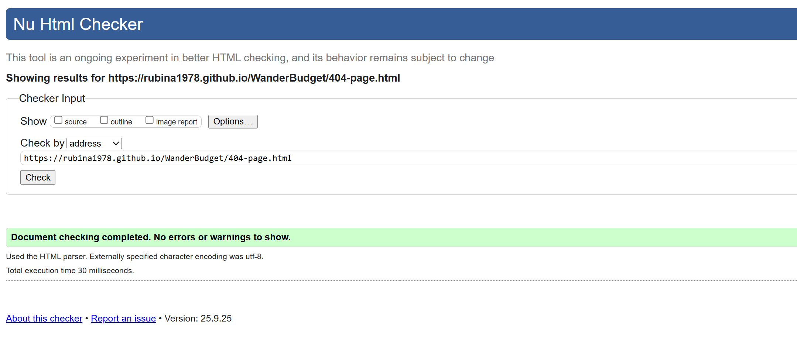
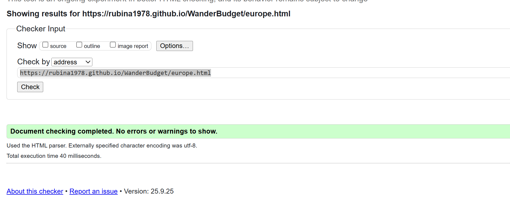
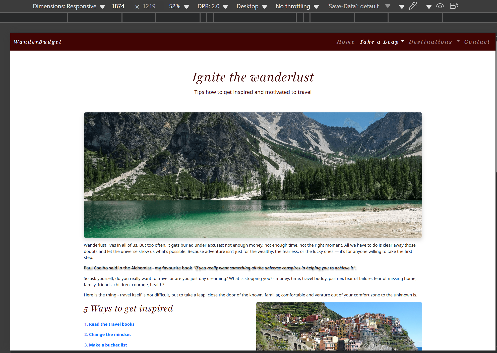
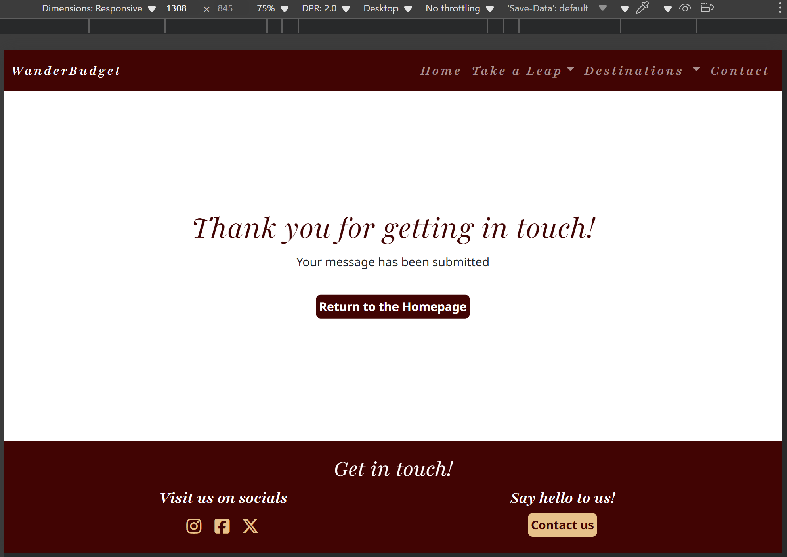
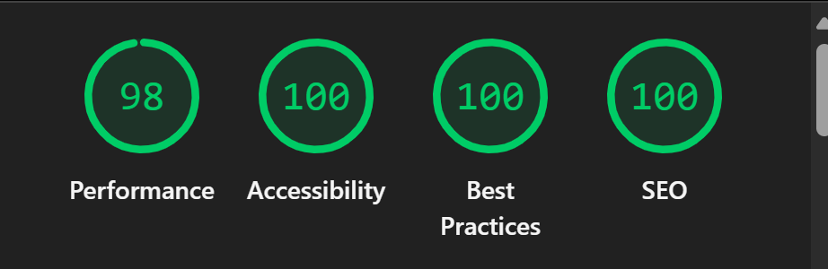
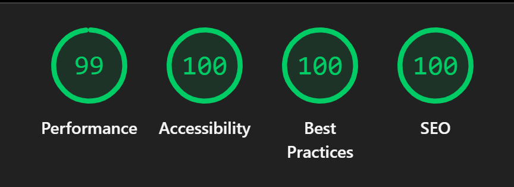

# Testing

> [!NOTE]  
> Return back to the [README.md](README.md) file.

## Code Validation

### HTML

I have used the recommended [HTML W3C Validator](https://validator.w3.org) to validate all of my HTML files.

| Directory | File | URL | Screenshot |
| --- | --- | --- | --- |
|  | [404.html](https://github.com/Rubina1978/WanderBudget/blob/main/404.html) | [HTML Validator](https://validator.w3.org/nu/?doc=https://rubina1978.github.io/WanderBudget/404.html) |  |
|  | [contact-us.html](https://rubina1978.github.io/WanderBudget/contact-us.html) | [HTML Validator](https://validator.w3.org/nu/?doc=https://rubina1978.github.io/WanderBudget/contact-us.html) |  |
|  | [europe.html](https://rubina1978.github.io/WanderBudget/europe.html) | [HTML Validator](https://validator.w3.org/nu/?doc=https://rubina1978.github.io/WanderBudget/europe.html) |  |
|  | [ignite-the-wanderlust.html](https://rubina1978.github.io/WanderBudget/ignite-the-wanderlust.html) | [HTML Validator](https://validator.w3.org/nu/?doc=https://rubina1978.github.io/WanderBudget/ignite-the-wanderlust.html) |  |
|  | [index.html](https://rubina1978.github.io/WanderBudget/index.html) | [HTML Validator](https://validator.w3.org/nu/?doc=https%3A%2F%2Frubina1978.github.io%2FWanderBudget%2Findex.html) |  | 
|  | [make-the-most-of-it.html](https://github.com/Rubina1978/WanderBudget/blob/main/make-the-most-of-it.html) | [HTML Validator](https://validator.w3.org/nu/?doc=https://rubina1978.github.io/WanderBudget/make-the-most-of-it.html) |  | 
|  | [north-america.html](https://rubina1978.github.io/WanderBudget/north-america.html) | [HTML Validator](https://validator.w3.org/nu/?doc=https://rubina1978.github.io/WanderBudget/north-america.html) |  | 
|  | [plan-your-trip.html](https://rubina1978.github.io/WanderBudget/plan-your-trip.html) | [HTML Validator](https://validator.w3.org/nu/?doc=https://rubina1978.github.io/WanderBudget/plan-your-trip.html) |  |
|  | [success.html](https://rubina1978.github.io/WanderBudget/success.html) | [HTML Validator](https://validator.w3.org/nu/?doc=https://rubina1978.github.io/WanderBudget/success.html) |  | 
|  | [ways-to-get-cheap-accommodation.html](https://rubina1978.github.io/WanderBudget/ways-to-get-cheap-accommodation.html) | [HTML Validator](https://validator.w3.org/nu/?doc=https://rubina1978.github.io/WanderBudget/ways-to-get-cheap-accommodation.html) |  |
|  | [ways-to-get-cheap-flights.html](https://rubina1978.github.io/WanderBudget/ways-to-get-cheap-flights.html) | [HTML Validator](https://validator.w3.org/nu/?doc=https://rubina1978.github.io/WanderBudget/ways-to-get-cheap-flights.html) |  | 
|  | [ways-to-save-for-travel.html](https://rubina1978.github.io/WanderBudget/ways-to-save-for-travel.html) | [HTML Validator](https://validator.w3.org/nu/?doc=https://rubina1978.github.io/WanderBudget/ways-to-save-for-travel.html) |  |

### CSS

I have used the recommended [CSS Jigsaw Validator](https://jigsaw.w3.org/css-validator) to validate all of my CSS files.

| Directory | File | URL | Screenshot | Notes |
| --- | --- | --- | --- | --- |
| assets | [style.css](https://github.com/Rubina1978/WanderBudget/blob/main/assets/css/style.css) | [CSS Validator](https://jigsaw.w3.org/css-validator/validator?uri=https://rubina1978.github.io/WanderBudget) |  |

## Responsiveness

I've tested my deployed project to check for responsiveness issues.

| Page | Mobile | Tablet | Desktop | Notes |
| --- | --- | --- | --- | --- |
| Home |  |  |  | Works as expected |
| Ignite the Wanderlust |  |  |  | Works as expected |
| Ways to save for travel |  |  |  | Works as expected |
| Plan your trip |  |  |  | Works as expected |
| Ways to get cheap flight | |  |  | Works as expected |
| Ways to get cheap accommodation |  |  |  | Works as expected |
| Make the Most of it |  |  |  | Works as expected |
| Europe |  |  |  | Works as expected |
| North America |  |  |  | Works as expected |
| Contact us |  |  |  | Works as expected |
| 404 |  |  |  | Works as expected |
| Success |  |  |  | Works as expected |

## Browser Compatibility

I've tested my deployed project on multiple browsers to check for compatibility issues.

| Page | Chrome | Firefox | Edge | Notes |
| --- | --- | --- | --- | --- |
| Home |   |  |  | Works as expected |
| Ignite the wanderlust |  |  |  | Works as expected |
| Ways to save for travel |  |  |  | Works as expected |
| Plan your trip |  |  |  | Works as expected |
| Ways to get cheap flight |  |  |  | Works as expected |
| Ways to get cheap accommodation |  |  |  | Works as expected |
| Make the most of it |  |  |  | Works as expected |
| Europe |  |  |  | Works as expected |
| North America |  |  |  | Works as expected |
| Contact us |  |  |  | Works as expected |
| Success |  |  |  | Works as expected |
| 404 |  |  |  | Works as expected |

## Lighthouse Audit

I've tested my deployed project using the Lighthouse Audit tool to check for any major issues. Some warnings are outside of my control, and mobile results tend to be lower than desktop.

| Page | Mobile | Desktop |
| --- | --- | --- |
| Home |  |  |
| Ignite the wanderlust |  |  |
| Ways to safe for travel |  |  |
| Plan your trip |  |  |
| Ways to get cheap flight |  |  |
| Ways to get cheap accommodation|  |  |
| Make the most of it |  |  |
| Europe |  |  |
| North America |  |  |
| Contact us |  |  |
| Success |  |  |
| 404 |  |  |

## User Story Testing

| Target | Expectation | Outcome | Screenshot | 
| --- | --- | --- | --- | 
| As a user | I want a clear, user-friendly homepage and navigation, so I can quickly see if the website is providing what I am looking for and easily find relevant information.| Homepage feature clear introductions to the page, common objections and directories to specific pages |  |
| As a user |  I want motivational and informative content with high-quality images and simple explanations.| Each page is formulated in easy to follow, clear and concise, short articles separated by topics to provide information, inspire and motivate without getting user ovewhelmed with large and long articles to read and accompanied with number of images for an inspiration |  |
| As a user | I would like clear fonts, good contrast, and simple language,so the site is easy to read and navigate. | each content on pages is formulated by distinctive header to each topic and clear font for the content |  |
| As a user |  I want clear step-by-step information, so that I don’t feel overwhelmed by planning a trip on my own. | pages are formulated in clear step by step manner for good understanding and following the practice |  |
| As a user | I want tips and resources in one place, so that I don’t spend too much time searching across the internet | Most pages include link cards directing users to relevant third-party resources, allowing easy access to further information or booking options and minimizing time spent searching externally. |  |
| As a user | I would like to follow WanderBudget on various platforms (e.g., Instagram, Facebook, Twitter), so that I can stay updated with new content and ideas. | Footer section contain links to social media pages and on the top of that user has also an option to get in touch with Wanderbudget via Contact us button leading to Wanderbudger contact form. |  |
| As a user | I would like the website to be fully responsive, so that I can easily navigate and access information on the go from my phone or tablet, and from comfort of my home on desktop. | The website is fully responsive on all (devices mobile, tablet and desktop)  |  |
| As a user | I would like to see a 404 error if something goes wrong,so that it's obvious that I've stumbled upon a page that doesn't exist. | website has custom 404 page to indicate user if something is wrong and does not work |  |
| As a user | I would like to know that my message was sent by seeing a success message, so that i know that the author received it and will be in touch soon. | When user submit form, success page will appear to indicate that message was sent (simulated due to the lack of a database or email system so far) |  |

## Bugs

### Fixed Bugs

I've used [GitHub Issues](https://www.github.com/Rubina1978/WanderBudget/issues) to track and manage bugs and issues during the development stages of my project.

All previously closed/fixed bugs can be tracked [here](https://www.github.com/Rubina1978/WanderBudget/issues?q=is%3Aissue+is%3Aclosed+label%3Abug).

### Unfixed Bugs

Any remaining open issues can be tracked [here](https://www.github.com/Rubina1978/WanderBudget/issues?q=is%3Aissue+is%3Aopen+label%3Abug).

### Known Issues

| Issue | Screenshot |
| --- | --- |
| On tablet devices such as IpadPro or SurfacePro, last two links to articles on some pages do not scroll to the title of the article properly, they are either above or below. |  |

> [!IMPORTANT]  
> There are no remaining bugs that I am aware of, though, even after thorough testing, I cannot rule out the possibility.

